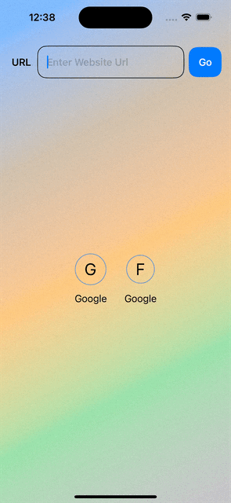

# SwiftUI Web Loader

SwiftUI Web Loader is a simple and elegant SwiftUI project that allows you to load and display any URL within the app. The app features a minimalistic user interface with an input field for entering the website URL and a "Go" button to load the website. The project showcases the power of SwiftUI and WKWebView to provide a seamless web browsing experience within a native app.

## Features

- **Load Any URL**: Enter any website URL to load and view the website within the app.
- **Elegant UI**: Minimalistic design with an easy-to-use interface.
- **SwiftUI**: Leveraging the latest SwiftUI framework for modern iOS development.
- **WKWebView**: Integrating WKWebView to handle web content seamlessly.

## Demo



## Installation

To run this project on your local machine, follow these steps:

1. **Clone the repository**:
   ```sh
   git clone https://github.com/RanaAk/SwiftUI-Web-Loader.git
   ```
2. **Navigate to the project directory**:
   ```sh
   cd SwiftUI-Web-Loader
   ```
3. **Open the project in Xcode**:
   ```sh
   open SwiftUI-Web-Loader.xcodeproj
   ```
4. **Run the project**:
   - Select the target device or simulator.
   - Press `Cmd + R` to build and run the project.

## Usage

1. Launch the app on your device or simulator.
2. Enter the desired website URL in the input field.
3. Press the "Go" button to load the website.
4. The website will be displayed within the app.


<!-- ### Main Screen

 -->

## Requirements

- iOS 15.0+
- Xcode 13.0+
- Swift 5.0+


